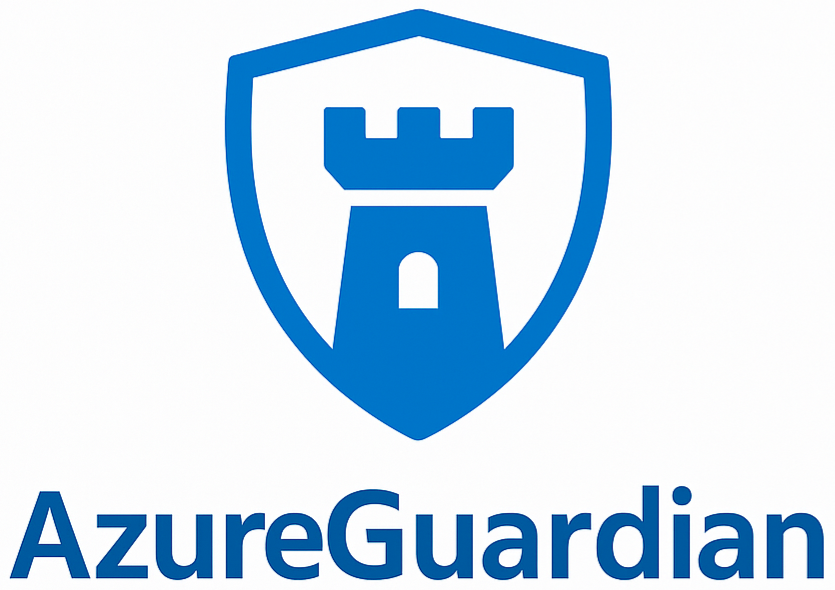
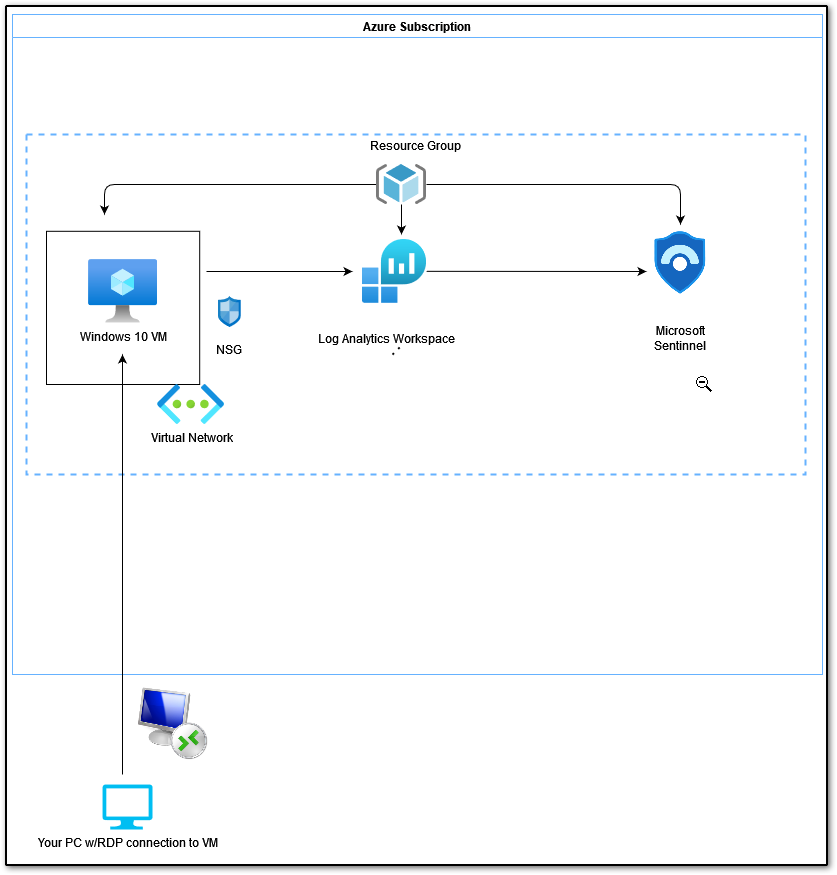
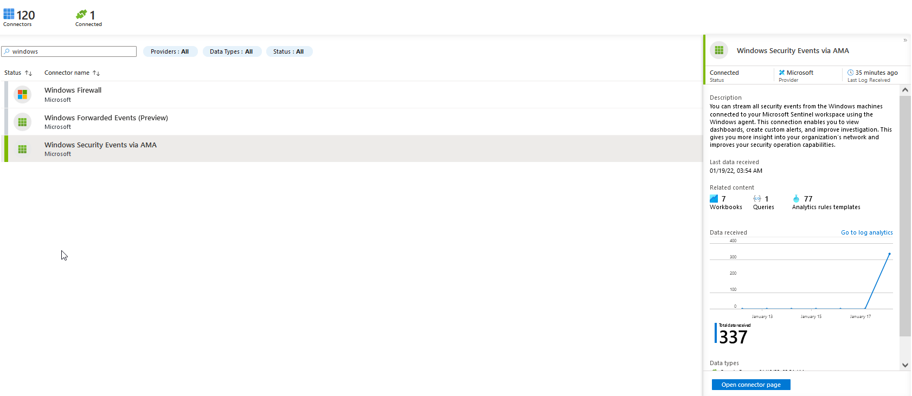
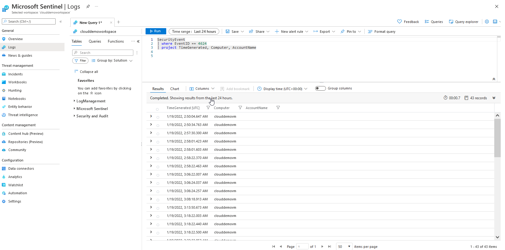
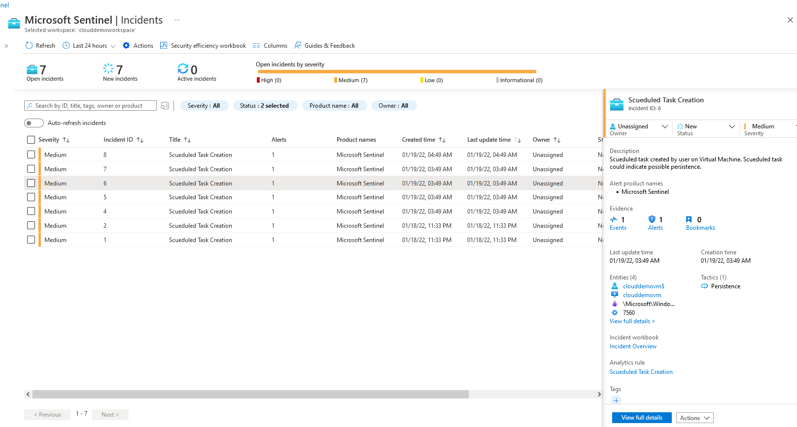
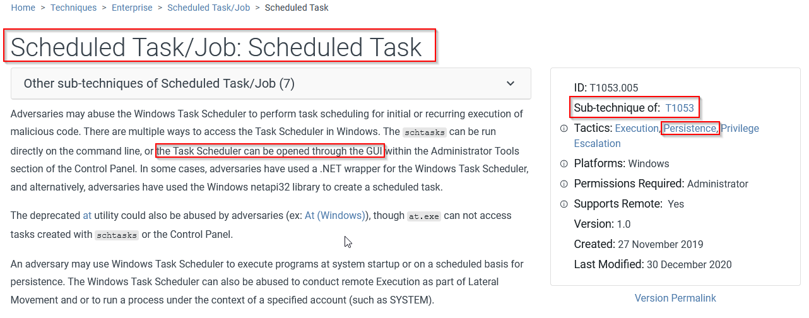

  
<h1 align="center">
    
</h1>
  
  

  <h1>Welcome to AzureGuardian — Guarding Your Cloud, One Log at a Time.</h1>
  
  

  AzureGuardian is a hands-on lab project that simulates real-world threat detection using Microsoft Sentinel in Azure.
  

  
  
<!-- Badges -->

  
  
  
  
  
  

   
<h4>
    <a href="https://github.com/Raouf-Braham/AzureGuardian">Documentation</a>
   · 
    <a href="https://github.com/Raouf-Braham/AzureGuardian/issues/">Report Bug</a>
   · 
    <a href="https://github.com/Raouf-Braham/AzureGuardian/issues/">Request Feature</a>
  </h4>

 

<!-- Table of Contents -->
# Table of Contents

- [About the Project](#about-the-project)
  * [Mission](#mission)
  * [Tutorial](#tutorial)
  * [Tech Stack](#tech-stack)
  * [Features](#features)
  * [Color Reference](#color-reference)
- [Getting Started](#getting-started)
  * [Run Locally](#run-locally)
- [Usage](#usage)
- [Roadmap](#roadmap)
- [Contributing](#contributing)
  * [Code of Conduct](#code-of-conduct)
- [License](#license)
- [Contact](#contact)
- [Acknowledgements](#acknowledgements)
  

<!-- About the Project -->
## About the Project

<!-- Mission -->
### Mission
Enable blue‑team professionals and students to:
- Deploy and secure Azure resources for log collection  
- Ingest and analyze Windows security events in Sentinel  
- Write Kusto Query Language (KQL) analytics to detect suspicious activity  
- Map detections to MITRE ATT&CK techniques for actionable threat intelligence

<!-- Tutorial -->
### Tutorial

New to AzureGuardian? Here's how to get started:

1. Lab Architecture

2. **Setup Lab Resources**  
   - Create a free Azure account  
   - Deploy a Resource Group, Windows VM, and Log Analytics Workspace  
   - Enable Just‑In‑Time VM access via Microsoft Defender for Cloud
     
3. **Connect to Sentinel**  
   - Enable and configure Microsoft Sentinel in your Log Analytics Workspace  
   - Add the “Windows Security Events via AMA” data connector
     
4. **Generate & Observe Security Events**  
   - RDP into your VM, open Event Viewer → Security logs  
   - Trigger events (e.g. successful logins, policy changes) 

4. **Kusto Query Language (KQL)**  
   - Run sample queries (e.g. `SecurityEvent | where EventID == 4624 | project TimeGenerated, Computer, AccountName`)  
   - Understand basic KQL operators: `where`, `project`, `parse`

     
5. **Custom Analytic Rule**  
   - Enable Windows Audit Policy for Scheduled Task events (ID 4698)  
   - Create a scheduled task to generate a 4698 event  
   - Write & deploy a custom analytic rule in Sentinel using parsed EventData fields

 

6. **Map to MITRE ATT&CK**  
   - Identify the persistence tactic (TA0003) and technique (T1053.005)  
   - Review detection and mitigation guidance from MITRE

    

 

<!-- TechStack -->
### Tech Stack

- **Azure Services**:  
  - Azure Virtual Machine (Windows 10)  
  - Azure Resource Group  
  - Log Analytics Workspace  
  - Microsoft Sentinel  
  - Microsoft Defender for Cloud
    
- **Tools & Languages**:  
  - Kusto Query Language (KQL)  
  - Windows Event Viewer & Local Security Policy  
  - RDP client (Remote Desktop Connection)

<!-- Features -->
### Features

- Automated deployment of Azure resources for SIEM  
- In‑depth tutorial on ingesting Windows security logs  
- Sample KQL queries and parsing techniques  
- Custom analytic rule for detecting scheduled task creation  
- MITRE ATT&CK mapping for persistence detection  
- Cost‑management best practices (JIT access, shutdown VMs)

<!-- Getting Started -->
## Getting Started

<!-- Run Locally -->
### Run Locally

All steps are performed in the Azure Portal and within your Windows VM. No local server is required.

<!-- Usage -->
## Usage

Use this lab to:

 • Monitor logs in Microsoft Sentinel

 • Copy and paste KQL snippets into the Sentinel Logs and Analytics Rules blades

 • Monitor the Incidents pane for custom alerts

<!-- Roadmap -->
## Roadmap

- Add Linux VM event ingestion module

- Provide ARM templates/Bicep for automation

- Extend analytic rules to detect lateral movement

- Integrate playbooks for automated response

<!-- Contributing -->
## Contributing

Contributions are always welcome!

See `contributing.md` for ways to get started.

<!-- Code of Conduct -->
### Code of Conduct

Please read the [Code of Conduct](https://github.com/Raouf-Braham/AzureGuardian/blob/master/CODE_OF_CONDUCT.md)

<!-- License -->
## License

Distributed under the no License. See LICENSE.txt for more information.

<!-- Contact -->
## Contact

Linkedin - [@Raouf Braham](https://www.linkedin.com/in/raouf-braham-67b365251/) | Email - raouf.brahem@eniso.u-sousse.tn

Project Link: [https://github.com/Raouf-Braham/HoneyShield](https://github.com/Raouf-Braham/HoneyShield)

<!-- Acknowledgments -->
## Acknowledgements

• Microsoft Sentinel product team

• MITRE ATT&CK framework

• Community contributors who provided feedback
